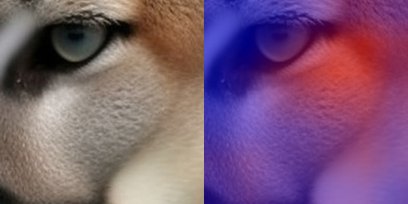

# AI Image Forensics

A CNN-based detector for AI-generated images, built to measure where such
detectors fail rather than to report a single headline accuracy.

The detector reaches 0.9986 ROC-AUC on clean test images. That number falls to
0.842 under a mild Gaussian blur and 0.870 under JPEG quality 30. This
repository documents that gap, its causes, and one measured mitigation.

**Status: V1.** Classifier, evaluation and experiments are complete. Provenance,
watermark, fingerprint and frequency modules are documented as future work and
are deliberately not stubbed out.

---

## Problem

Published AI-image detectors routinely report 95%+ accuracy. Two evaluation
choices inflate those numbers:

1. **Testing on generators seen during training.** Real-world images come from
   models that did not exist when the detector was built.
2. **Testing on pristine images.** Real-world images have been compressed,
   resized and re-encoded by messaging apps and social platforms.

This project measures both effects on a single detector under controlled
conditions.

---

## Dataset and bias control

Training data is [Tiny-GenImage](https://huggingface.co/datasets/TheKernel01/Tiny-GenImage),
a scaled-down GenImage containing real photographs plus images from eight
generator families.

**Auditing the raw data first turned up a confound.** Sampling 3,000 images and
reading their stored bytes without decoding showed:

| Class | File format | Typical size |
|---|---|---|
| Real | JPEG (1499/1499) | variable (500×375, 500×333, …) |
| ADM | PNG (224/224) | 256×256 |
| BigGAN | PNG (223/223) | 128×128 |
| GLIDE | PNG (200/200) | 256×256 |
| Midjourney | PNG (200/200) | 1024×1024 |
| SD15 | PNG (206/206) | 512×512 |
| VQDM | PNG (231/231) | 256×256 |
| Wukong | PNG (217/217) | 512×512 |

Format separates the classes perfectly, and image size nearly identifies the
generator. A model trained on this data can score near-perfectly by learning
"PNG means fake" without examining image content. This matches the confound
reported by Grommelt et al. (2024), *Fake or JPEG? Revealing Common Biases in
Generated Image Detection Datasets*.

`src/data/prepare.py` therefore puts every image through an identical pipeline:
centre-crop to 256×256 and re-encode as JPEG at quality 95. Both classes end up
with identical size and compression history. The `--no-debias` flag builds the
confounded version for comparison.

**Result of the ablation:** in-distribution ROC-AUC was 0.9998 (confounded) vs
0.9997 (controlled) — indistinguishable. Both models sit at the ceiling, where
the metric cannot separate them. The ablation therefore does not show that the
bias was harmless; it shows that in-distribution AUC is the wrong instrument for
detecting it.

**Excluded:** BigGAN, whose 128×128 images fall below the 256px crop threshold.
This removes the only GAN from the study — see Limitations.

Final curated set: 6,000 images, 500 per generator across 7 generators, 3,000
real, split 70/15/15 into train/val/test.

---

## Method

**Crop, never resize.** Generator artefacts live in high frequencies, and
resampling destroys them. All crops are taken at native resolution. The standard
`transforms.Resize(224)` used in most classification tutorials is actively
harmful here.

**Models.** A from-scratch baseline (`ForensicCNN`, 1.17M parameters, stride-1
convolutions with pooling deferred to the end of each block so early layers
retain high-frequency detail) and ImageNet-pretrained ResNet18 (11.18M
parameters).

**Selection.** Best epoch chosen by validation ROC-AUC, not accuracy — AUC is
threshold-free and unaffected by the class-ratio drift that group-based
splitting introduces.

---

## Results

All numbers below come from `experiments/*/results.json`. Nothing is estimated.

### Model comparison

| Model | Parameters | Val ROC-AUC | Test ROC-AUC |
|---|---|---|---|
| ForensicCNN (from scratch) | 1.17M | 0.9819 | — |
| ResNet18 (pretrained) | 11.18M | 0.9997 | 0.9986 |

Transfer learning is worth roughly 1.8 AUC points here. The baseline was still
improving when its epoch budget ran out, so this overstates the gap somewhat.

### Unseen-generator generalisation

Six models trained, each excluding one generator entirely. Each generator's AUC
is compared between the baseline model (which saw it) and the holdout model
(which did not). Same test images, same architecture, one variable.

| Held out | Seen AUC | Unseen AUC | Drop |
|---|---|---|---|
| Midjourney | 0.9972 | 0.9750 | +0.0222 |
| ADM | 0.9979 | 0.9818 | +0.0161 |
| VQDM | 0.9990 | 0.9956 | +0.0034 |
| GLIDE | 0.9995 | 0.9975 | +0.0020 |
| SD15 | 0.9996 | 0.9991 | +0.0005 |
| Wukong | 0.9987 | 0.9985 | +0.0001 |

Mean drop +0.0074. **All six drop, in the same direction** — the consistency
matters more than the magnitude, since random variation would put at least one
in the other direction.

The spread is two orders of magnitude. Wukong and SD15 lose almost nothing:
both have close architectural relatives remaining in training (SD14 for SD15;
Wukong is architecturally similar to the Stable Diffusion family). Midjourney is
worst and is the only closed commercial model with no relative in the training
set. ADM is second-worst and is pixel-space rather than latent diffusion.

**Claim:** detection transfers well within a generator family and degrades when
the held-out generator has no close relative in training. Absolute performance
remains high (0.975 worst case), so the unseen-generator penalty measured here
is real but mild.

## Explainability

Grad-CAM heatmaps over the final convolutional layer, from the
JPEG+blur-augmented model. Red indicates regions whose activation
increased the AI-generated score.

| Image | Source | P(AI) |
|---|---|---|
| Real_00745 | real photograph | 0.0000 |
| Real_01437 | real photograph | 0.7987 |
| Midjourney_00434 | Midjourney | 0.9997 |
| SD15_00267 | SD15 | 0.9993 |
| ADM_00384 | ADM | 0.9997 |

`Real_01437` is a false positive: a photograph of a starfish scored 0.799.
The heatmap concentrates on the animal's textured ridges — the highest-
frequency region of the image. High-frequency natural texture appears
capable of triggering the same response as generation artefacts.

Synthetic examples show attention on texture boundaries (fur edges, plumage)
rather than on whole recognisable objects, which is weak evidence against the
scene-recognition concern raised in Limitations. It does not settle it.

**Grad-CAM shows where the model was sensitive, not why it decided.** The map
is 7x7 upscaled 32x, so it indicates coarse regions only, while generation
artefacts are fine-grained and often global. Diffuse heatmaps are expected.





### Robustness to real-world transformations

Accuracy on the test set after applying each transformation at evaluation time.
Three models, differing only in training-time augmentation.

| Transformation | No augmentation | JPEG + blur | JPEG + blur + resize |
|---|---|---|---|
| original | **0.9833** | 0.9589 | 0.9489 |
| JPEG q90 | 0.9222 | 0.9211 | 0.8789 |
| JPEG q70 | 0.7022 | **0.8744** | 0.8256 |
| JPEG q50 | 0.6233 | **0.8433** | 0.8111 |
| JPEG q30 | 0.5600 | 0.7878 | **0.7911** |
| resize 75% | 0.8200 | 0.9200 | **0.9422** |
| resize 50% | 0.6233 | 0.9000 | **0.9322** |
| blur σ=1.5 | 0.4989 | 0.8800 | **0.8989** |
| screenshot | 0.7644 | **0.8367** | 0.8211 |

**Without augmentation, a Gaussian blur reduces the detector to 0.499 accuracy —
chance.** JPEG q30 reaches 0.560.

**Augmentation transfers across degradation types.** The clean hypothesis was
that a model is robust only to degradations it trained on. The data contradicts
this: JPEG+blur augmentation lifted resize-50% accuracy from 0.623 to 0.900
despite containing no resize. Adding explicit resize augmentation bought only a
further 0.032. Plausible mechanism: all three degradations attack the same
high-frequency information, so training against any of them pushes the model
toward features that survive all of them.

**The cost is real.** Clean accuracy falls 0.9833 → 0.9589 → 0.9489 as
augmentations accumulate. The third model is also slightly worse on JPEG than
the second (0.8256 vs 0.8744 at q70), consistent with a fixed epoch budget being
divided across more augmentation types.

### Accuracy and AUC diverge under degradation

The unaugmented model at resize 75%: accuracy 0.8200, ROC-AUC **0.9951**.

The ranking is nearly perfect while the thresholded decision degrades sharply.
Degradation does not destroy the model's discriminative information; it shifts
the score distribution relative to the fixed 0.5 threshold. The model remains
informative while becoming **miscalibrated**.

This distinguishes *prediction confidence* from *evidence reliability*, and
implies a deployed system should either select thresholds per image-quality band
or report reduced reliability on degraded inputs rather than a raw probability.

---

## A measurement bug, and how it was found

An earlier version of the resize perturbation downscaled without restoring the
original dimensions. At 50% scale a 256×256 image becomes 128×128 — below the
224px crop — so `_crop` fell back to reflection padding, and most of the
resulting tensor was padding rather than image.

The symptom was three different models returning resize-50% accuracy of 0.4822,
0.4833 and 0.4822. Near-identical numbers across models that clearly differed
elsewhere prompted a check of the raw prediction distribution:

```
min 0.746  max 1.000  mean 0.989  frac>0.5 1.000
```

Every image, real or synthetic, was classified as AI-generated. Reflection
padding introduces mirrored edges and unnatural high-frequency structure that
resembles the synthetic signature the model detects, saturating the classifier.
The reported accuracy was simply the test set's class balance.

Fixed by downscaling and restoring the original dimensions, which destroys the
same detail a real resize would while keeping the image above the crop size. All
resize figures above use the corrected implementation.

---

## Installation

```bash
git clone https://github.com/georgevarghese21/ai-image-forensics.git
cd ai-image-forensics
python -m venv .venv && source .venv/bin/activate
pip install torch torchvision --index-url https://download.pytorch.org/whl/cpu
pip install -r requirements.txt
```

## Running

Data is expected at `data/raw/real/` and `data/raw/ai/<generator>/`.

```bash
# Curate: standardise format and size, balance classes, assign splits
python -m src.data.prepare --source data/raw --out data/processed/debiased

# Confounded version, for the bias ablation
python -m src.data.prepare --source data/raw --out data/processed/biased --no-debias

# Train
python -m src.train --config configs/v1.yaml --model resnet18 --tag rn18
python -m src.train --config configs/v1.yaml --model resnet18 --tag rn18_aug --augment

# Evaluate, with per-generator breakdown and robustness sweep
python -m src.evaluate --checkpoint experiments/rn18/best.pt --robustness

# Leave-one-generator-out sweep across all generators
bash scripts/logo_sweep.sh
python scripts/collect_logo.py
```

Set `holdout_generators: ["Midjourney"]` in `configs/v1.yaml` to exclude a
generator from a single training run.

Training was run on a Colab T4 (~15s/epoch for ResNet18 at this dataset size).

---

## Limitations

**All generators are diffusion-family.** BigGAN, the only GAN, was excluded by
the 256px crop threshold. The hardest generalisation test — holding out an
entirely different architecture class — was therefore not run. The mild
unseen-generator penalty reported above should not be extrapolated to
architectures outside this family.

**No content-disjoint splitting.** Tiny-GenImage carries no content labels, so
`group_key` assigns each file its own group and splits are effectively
file-level. GenImage generates synthetic images by prompting with ImageNet class
names, so the same semantic class appears across splits. Some portion of the
0.9986 test AUC may reflect scene recognition rather than artefact detection.
This is the most likely explanation for scores this high and has not been ruled
out.

**Single seed per experiment.** No confidence intervals. The leave-one-generator-out
ordering is suggestive, not established.

**Scale.** 500 images per generator, from a dataset of 28,000. Results at full
scale may differ.

**In-distribution metrics are saturated.** At AUC ≈ 0.999 the metric cannot
distinguish between models, which is why the bias ablation was inconclusive
in-distribution. Degraded-input evaluation proved far more discriminative.

**Pretrained backbone overlap.** ResNet18's ImageNet pretraining shares a data
source with GenImage's real class. Not leakage in the strict sense, but a
confound worth noting.

---

## Ethical considerations

A detector of this kind can cause harm through false accusation. Three points
follow from the results above.

Absence of evidence is not evidence of authenticity: a "likely real" output
means no synthetic signature was found, not that the image is a photograph.
Performance on degraded images is substantially worse than headline figures
suggest, and most real-world images are degraded. And performance on generators
released after training is unmeasured and probably worse than the mild penalty
reported here.

Any deployment should surface a reliability estimate alongside the probability,
and should not be treated as evidence of image origin.

---

## Not implemented

Deliberately absent rather than stubbed:

**Invisible watermark detection.** There is no universal detector; each vendor
uses a different scheme. Without labelled watermarked images, an implementation
could not be validated against a single true positive — it would return "not
detected" for every input and appear to work.

**C2PA / Content Credentials.** Meaningful verification requires signature-chain
validation, and effectively no test image carries a manifest.

**Generator fingerprints** from noise residuals, and **frequency-domain
analysis** (FFT radial profiles, spectral features). Both are tractable and are
the natural next additions; neither was validated in the time available.

**Evidence fusion.** Combining detector outputs requires validated individual
outputs first.

## Future work

In priority order: hold out an entire architecture class (GAN vs diffusion) by
lowering the crop threshold or sourcing larger GAN images; multiple seeds with
confidence intervals; quality-conditional thresholding to address the
calibration finding; scaling to the full 28,000-image dataset; and frequency-domain
analysis as an independent second signal.

---

## References

Grommelt, P., Weiss, L., Pfreundt, F.-J., Keuper, J. (2024). *Fake or JPEG?
Revealing Common Biases in Generated Image Detection Datasets.* arXiv:2403.17608.

Zhu, M. et al. (2023). *GenImage: A Million-Scale Benchmark for Detecting
AI-Generated Image.* NeurIPS 2023.
